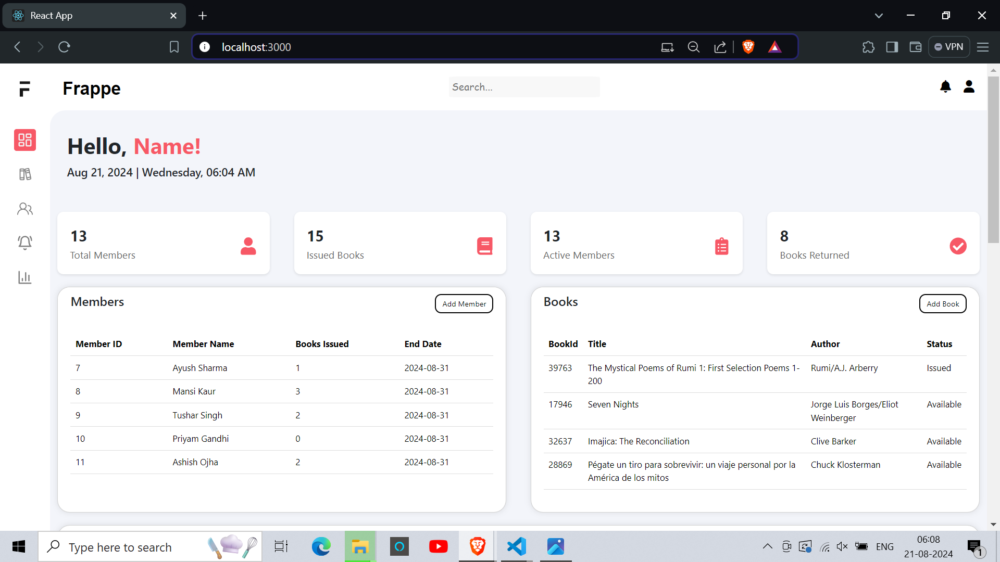
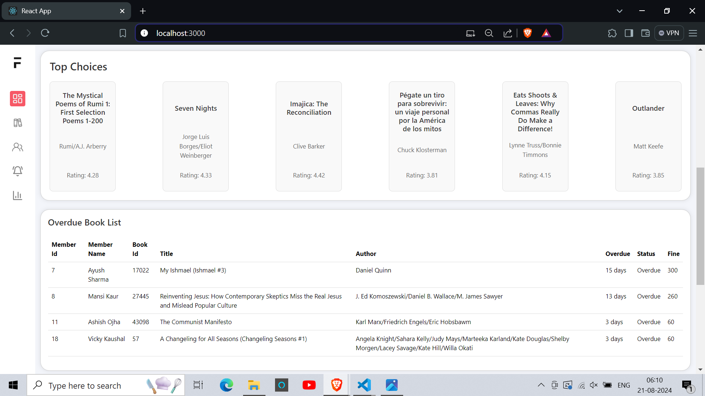
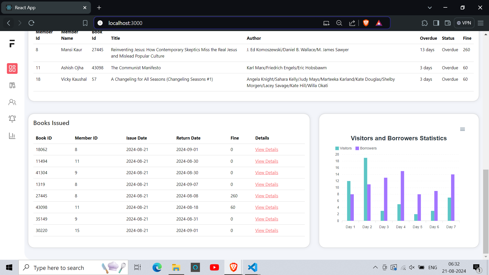
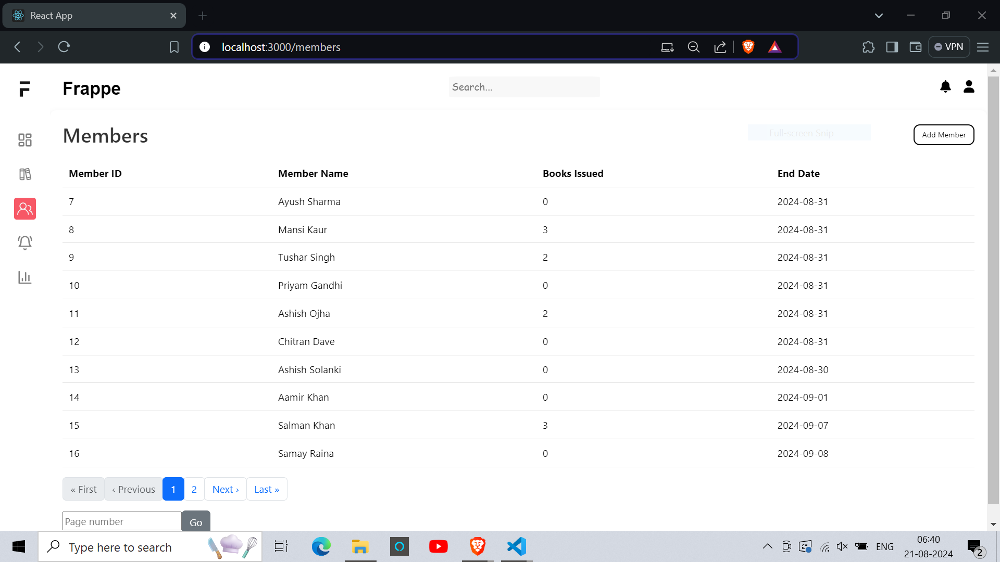
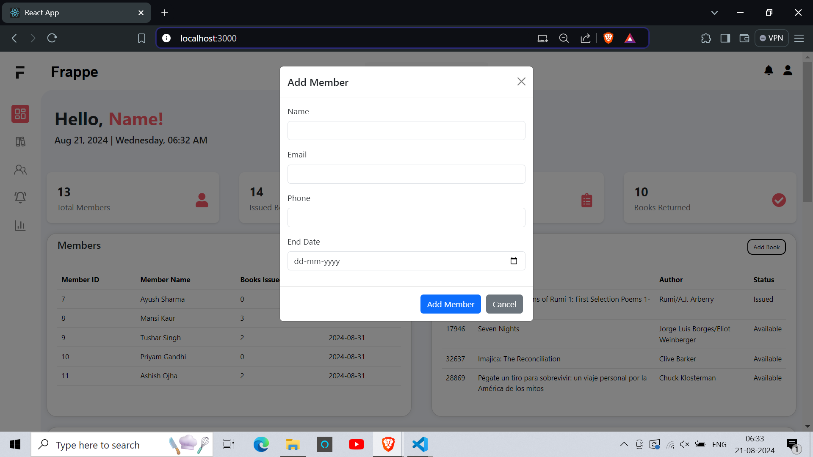
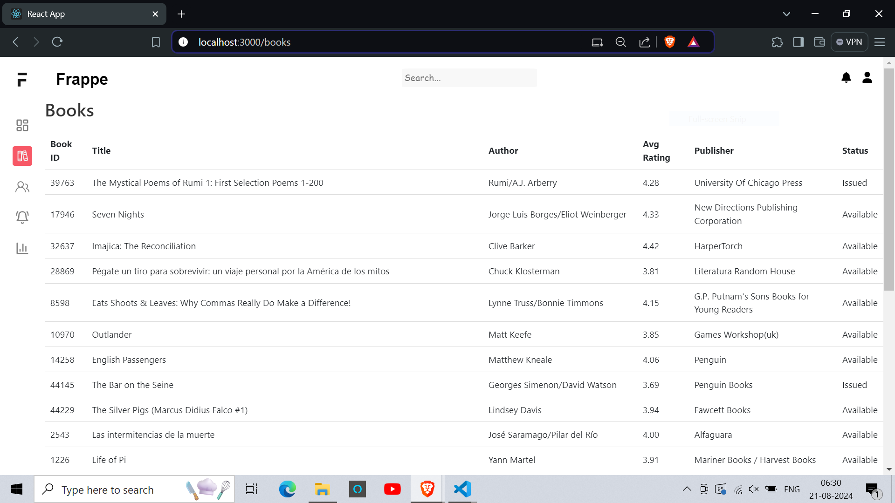
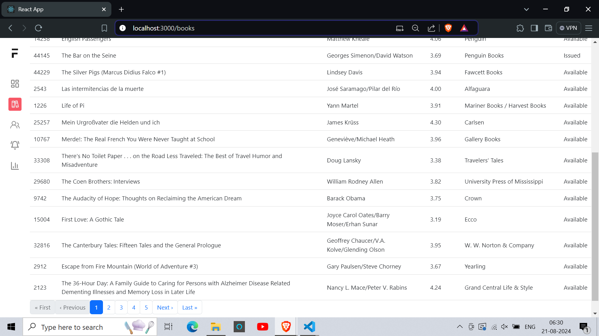
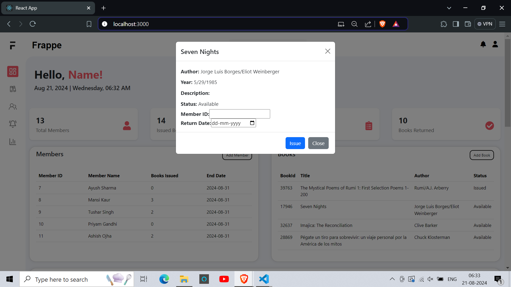
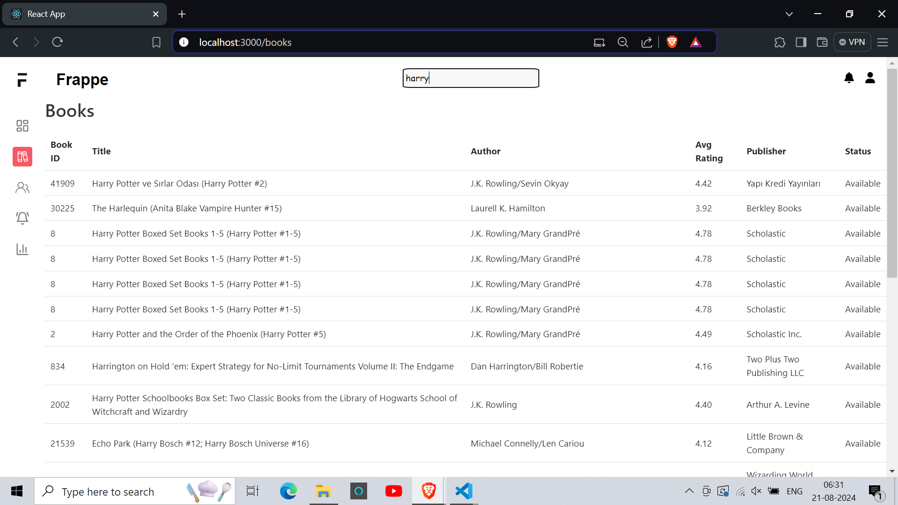
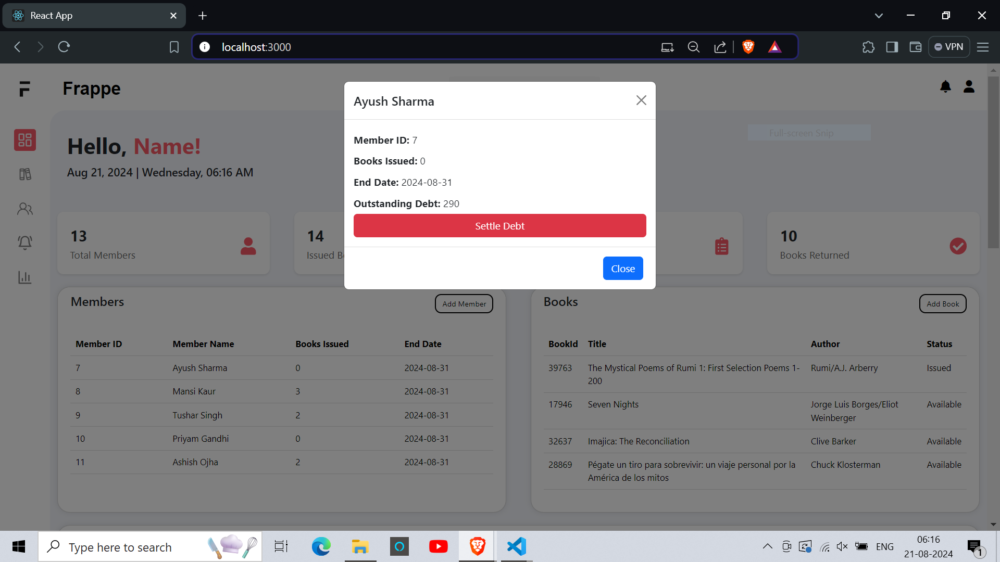

# **Frappe Library FrontEnd**

React based frontend application for Library management assignment.

## *Implemented Features*

Following features have been successfully implemented till now:
-   Dashboard
    
    
    

-   CRUD on Members
    
    

-   Display Books
    
-   Pagination
    
-   Issue/Return a Book
    
-   Handle issue history
-   Search books
    
-   Statistics
-   Setlle Debt
    
-   Charge a fee

## *Features In Progress*

Following features are in progress and will be implemented shortly:
-   Handling Book Stock
-   UI improvements
-   Statistics Page
-   Dues Page
-   Additional features

## *Deployment*

Due to issues with Live Backend not being able to hit Frappe API due to PythonAnywhere whitelisting issues, Frontend deployment isn't feasible.